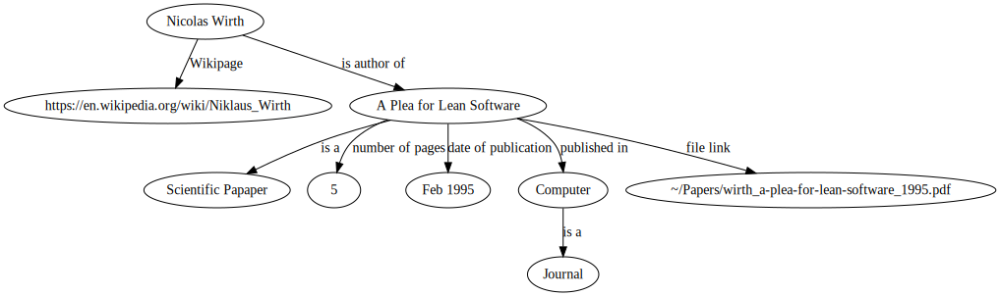
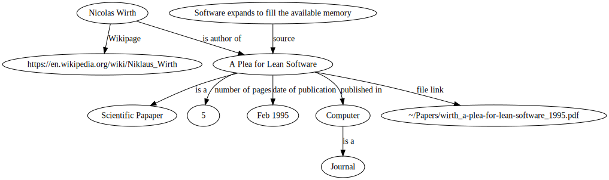
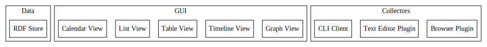

# Personal Knowledge Base
This documents lines out a vision for a personal knowledge base.

## Use Case

I am interested in the Paper "A Plea for lean software." by Nicolas With. I have used the browser plugin to automativally download the paper and add it and some meta information to the system. I can view this information as a graph:


Next, I read through the paper in the included PDF viewer. I find an interesting quote: 'Software exands to fill the available memory.'. I can mark the quote in the viewer and the systems automatically adds it to the graph:



The system allows me to link to specific positions in PDFs, text files and images.

Next, we want to find all quotes from Nicolas Wirth and view them in a Table. For that I define a view called quotes_by_autor that finds all quotes by any author:

```
quotes_by_autor AUTOR := QOUTE 'source' DOCUMENT & AUTOR 'is author of' DOCUMENT
```
(made up syntax)

I can call this view with any autor as a parameter. The result is a table with all the matching entries. The system includes a table viewer.

The system automatically generates BibTex files which can be used later to write Papers in Latex.

## User Interface
The user interface is made up of a REPL, a graph viewer and a table viewer. The REPL is aware of the current state of the graph and can operate easily on the visible nodes. The interface is optimized for keyboard use.

## Architecture


The system is made up of a number of applications which can be categorized into three parts. The data is stored in an RDF database (Triplestore). The GUI implemented as a Desktop App in Rust. It is scriptable using LISP. Collectors can be wrtitten in any language and are adding Data to the RDF store.